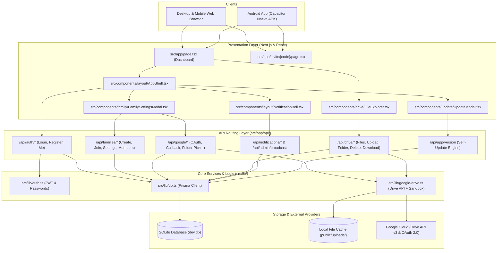
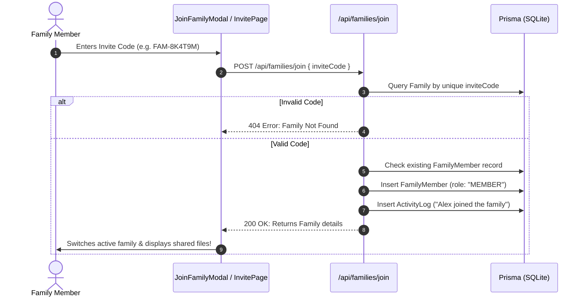
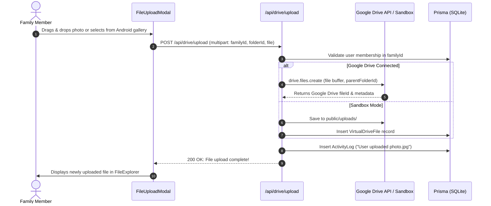
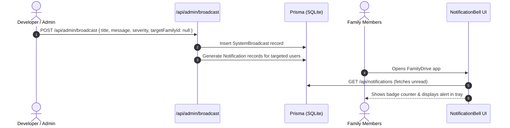
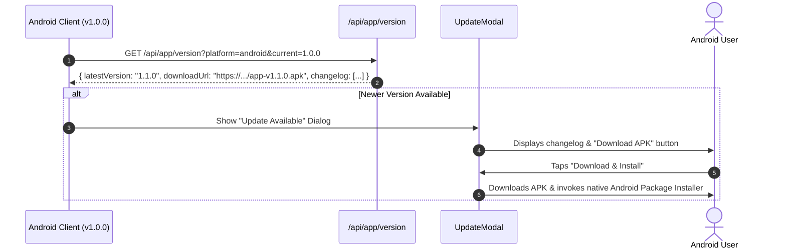

# File Connection Map & Architecture Reference
## FamilyDrive — System Interconnection & Data Flow

---

## 1. Directory Tree & File Inventory

```
drive app/
├── .github/
│   └── workflows/
│       ├── web-ci.yml                   # CI/CD: Automated linting, test & web build
│       └── android-build.yml            # CI/CD: Android APK build & release generation
├── docs/
│   ├── PRD.md                           # Product Requirements Document
│   ├── UI_UX_DESIGN.md                  # Visual tokens, screens & UX specifications
│   ├── FILE_CONNECTION_MAP.md           # This document (File map & architecture)
│   └── API_DOCUMENTATION.md             # REST API endpoints & payload schemas
├── prisma/
│   ├── schema.prisma                    # SQLite database schema (Users, Families, Files, Notifications)
│   └── seed.ts                          # Database seeder (Demo users, families, files, broadcasts)
├── public/
│   ├── manifest.json                    # PWA Web App Manifest (Android installable)
│   └── uploads/                         # Local sandbox upload storage directory
├── src/
│   ├── app/
│   │   ├── api/
│   │   │   ├── admin/
│   │   │   │   └── broadcast/route.ts   # Developer/Admin system broadcast creation
│   │   │   ├── app/
│   │   │   │   └── version/route.ts     # In-app Self-Update version check & APK metadata
│   │   │   ├── auth/
│   │   │   │   ├── login/route.ts       # Email/password authentication
│   │   │   │   ├── logout/route.ts      # Session termination
│   │   │   │   ├── me/route.ts          # Current authenticated user check
│   │   │   │   └── register/route.ts    # New user registration
│   │   │   ├── drive/
│   │   │   │   ├── download/[id]/route.ts # File stream for download & preview
│   │   │   │   ├── files/[id]/route.ts  # File & folder deletion with permission checks
│   │   │   │   ├── files/route.ts       # File & folder listing within root boundary
│   │   │   │   ├── folder/route.ts      # New subfolder creation
│   │   │   │   └── upload/route.ts      # Multi-part file upload handler
│   │   │   ├── families/
│   │   │   │   ├── [id]/
│   │   │   │   │   ├── activities/route.ts # Family activity audit log
│   │   │   │   │   ├── invite-code/route.ts# Invite code regeneration (Admin)
│   │   │   │   │   ├── members/route.ts # Member roster & remove member
│   │   │   │   │   └── route.ts         # Family details & settings update
│   │   │   │   ├── join/route.ts        # Join family via invite code
│   │   │   │   └── route.ts             # List user families & create new family
│   │   │   ├── google/
│   │   │   │   ├── auth-url/route.ts    # Google OAuth consent URL generator
│   │   │   │   ├── callback/route.ts    # OAuth callback, token exchange & storage
│   │   │   │   └── folders/route.ts     # Google Drive folder picker API
│   │   │   └── notifications/
│   │   │       ├── [id]/route.ts        # Mark notification as read
│   │   │       └── route.ts             # List notifications for current user
│   │   ├── invite/
│   │   │   └── [code]/page.tsx          # 1-Click invite landing page
│   │   ├── globals.css                  # Design system tokens & utility classes
│   │   ├── layout.tsx                   # Root HTML layout & fonts
│   │   └── page.tsx                     # Main Dashboard & file explorer page
│   ├── components/
│   │   ├── auth/
│   │   │   └── AuthCard.tsx             # Login, registration & quick demo accounts
│   │   ├── drive/
│   │   │   ├── Breadcrumbs.tsx          # Folder navigation breadcrumb trail
│   │   │   ├── DeleteConfirmModal.tsx   # Deletion confirmation dialog
│   │   │   ├── FileExplorer.tsx         # Main explorer toolbar, grid & state
│   │   │   ├── FileGrid.tsx             # Card view layout
│   │   │   ├── FileList.tsx             # Table view layout
│   │   │   ├── FilePreviewModal.tsx     # Lightbox previewer (images, video, audio, pdf)
│   │   │   ├── FileUploadModal.tsx      # Multi-file drag & drop queue
│   │   │   └── NewFolderModal.tsx       # Folder creation dialog
│   │   ├── family/
│   │   │   ├── ActivityFeedModal.tsx    # Family audit history stream
│   │   │   ├── CreateFamilyModal.tsx    # New family creation wizard
│   │   │   ├── FamilySettingsModal.tsx  # Drive config, invite codes, permissions
│   │   │   └── JoinFamilyModal.tsx      # Enter invite code modal
│   │   ├── layout/
│   │   │   ├── AppShell.tsx             # Main header, user profile, invite shortcuts
│   │   │   ├── FamilySwitcher.tsx       # Dropdown to switch active family
│   │   │   └── NotificationBell.tsx     # In-app developer broadcast notification tray
│   │   └── update/
│   │       └── UpdateModal.tsx          # In-app self-update checker & APK installer
│   ├── lib/
│   │   ├── auth.ts                      # Password hashing, JWT signing & verification
│   │   ├── db.ts                        # Prisma Client singleton
│   │   ├── google-drive.ts              # Google Drive API client + Sandbox fallback
│   │   └── utils.ts                     # Formatting, invite code generation, categories
│   └── types/
│       └── index.ts                     # TypeScript interfaces
├── capacitor.config.json                # Android Native Capacitor configuration
├── package.json                         # Dependencies & scripts
└── tsconfig.json                        # TypeScript configuration
```

---

## 2. High-Level Architecture Diagram



---

## 3. End-to-End User Data Flows

### Flow 1: Family Member Joins with Invite Code


### Flow 2: File Upload to Designated Google Drive Folder


### Flow 3: Developer Broadcasts In-App Notification


### Flow 4: In-App Self-Update (Android APK)


---

## 4. UI Component to API Endpoint Mapping

| Component | Target API Endpoint | HTTP Method | Payload / Response |
| :--- | :--- | :--- | :--- |
| `AuthCard.tsx` | `/api/auth/login` | `POST` | `{ email, password }` -> User session |
| `AuthCard.tsx` | `/api/auth/register` | `POST` | `{ name, email, password }` -> User session |
| `FamilySwitcher.tsx` | `/api/families` | `GET` | List of user's active families |
| `CreateFamilyModal.tsx` | `/api/families` | `POST` | `{ name, description }` -> Family |
| `JoinFamilyModal.tsx` | `/api/families/join` | `POST` | `{ inviteCode }` -> Joined Family |
| `FamilySettingsModal.tsx`| `/api/families/[id]` | `PATCH` | `{ name, allowMemberDelete, driveRootFolderId }` |
| `FamilySettingsModal.tsx`| `/api/families/[id]/invite-code` | `POST` | Regenerate code -> `{ inviteCode }` |
| `FamilySettingsModal.tsx`| `/api/families/[id]/members` | `GET`, `DELETE` | List / Remove member |
| `FamilySettingsModal.tsx`| `/api/google/auth-url` | `GET` | Initiates Google OAuth consent |
| `FileExplorer.tsx` | `/api/drive/files` | `GET` | List items inside active folder |
| `NewFolderModal.tsx` | `/api/drive/folder` | `POST` | `{ familyId, name, parentId }` |
| `FileUploadModal.tsx` | `/api/drive/upload` | `POST` | Multipart file upload |
| `FilePreviewModal.tsx` | `/api/drive/download/[id]` | `GET` | Stream file content with `inline=true` |
| `DeleteConfirmModal.tsx`| `/api/drive/files/[id]` | `DELETE`| Remove file/folder (permission guarded) |
| `NotificationBell.tsx` | `/api/notifications` | `GET`, `PATCH` | Fetch broadcasts, mark as read |
| `UpdateModal.tsx` | `/api/app/version` | `GET` | Check latest version & APK download link |
